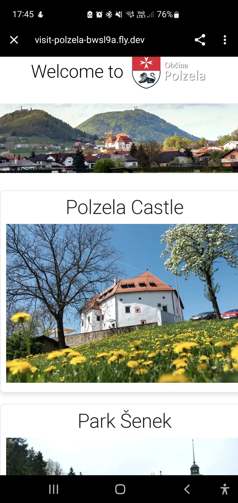

# Visit Polzela - Tourism POI Application

A Progressive Web Application (PWA) showcasing Points of Interest (POI) in Polzela, Slovenia. This multilingual tourism guide helps visitors explore local attractions, historical sites, and cultural landmarks with interactive maps and navigation features.



## 🌟 Features

### Multilingual Support
- **4 Languages**: English, Slovenian, German, and Dutch
- Dynamic language switching with flag buttons
- Localized POI titles, descriptions, and UI text
- Language preferences maintained throughout the app

### Points of Interest
The app features **16 curated attractions** including:
- Historical sites (Polzela Castle, Roman Legionary Camp)
- Religious landmarks (Churches of St. Margaret, St. Nicholas, St. Andrew)
- Natural attractions (Mount Oljka, River Ložnica)
- Cultural sites (Neža Maurer's Birthplace, Vintage Tractor Museum)
- Local experiences (Medo's Ice Cream, Whimsical Clay Figurines)

### Interactive Features
- **Image Gallery**: Each POI includes up to 3 additional images
- **Popup Image Viewer**: Click gallery images to view them in a fullscreen popup (80% screen width)
- **Interactive Maps**: OpenStreetMap integration showing exact POI locations
- **Navigation Integration**: Direct links to Google Maps and Apple Maps for turn-by-turn directions
- **Offline Support**: IndexedDB storage enables offline browsing
- **Installable PWA**: Can be installed as a standalone app on any device

### User Interface
- Clean, centered layout with consistent 800px max-width for content
- Responsive design optimized for desktop, tablet, and mobile devices
- Language flags positioned on the left, install button on the right
- Dynamic "Welcome to Polzela" greeting in selected language
- Coat of Arms (Grb) displayed prominently on the main view

## 🛠️ Technology Stack

### Backend
- **Quarkus 3.20.0**: Supersonic Subatomic Java Framework
- **Vaadin Flow 24.7.6**: Full-stack web framework
- **Java 17**: Required for Quarkus 3.0+
- **Maven**: Build and dependency management

### Frontend
- **React 18.3.1**: UI component library
- **React Router 7.9.3**: Client-side routing
- **TypeScript**: Type-safe JavaScript
- **Vite**: Build tool and dev server
- **IndexedDB (idb 8.0.3)**: Client-side data persistence
- **Leaflet**: Interactive map rendering

### PWA Features
- **Service Worker**: Offline caching and resource management
- **Workbox**: Advanced caching strategies
- **Web App Manifest**: Installation and icon configuration
- **HTTPS Support**: Secure connections via self-signed certificate

## 📁 Project Structure

```
visit-polzela/
├── src/main/
│   ├── frontend/
│   │   ├── views/
│   │   │   ├── MainView.tsx          # Home page with POI grid
│   │   │   └── POIDetailView.tsx     # Individual POI details
│   │   ├── services/
│   │   │   └── DataService.ts        # Data management & IndexedDB
│   │   ├── types/
│   │   │   └── POI.ts                # TypeScript interfaces
│   │   ├── styles/
│   │   │   ├── main-view-styles.css
│   │   │   └── poi-detail-view-styles.css
│   │   ├── routes.tsx                # Route configuration
│   │   └── index.tsx                 # App entry point
│   ├── java/com/example/            # Java backend (if needed)
│   └── resources/
│       ├── META-INF/resources/
│       │   ├── pointsofinterest/
│       │   │   ├── pois.txt          # POI data
│       │   │   └── poititles.txt     # Localized titles
│       │   ├── poi-descriptions/     # Localized descriptions
│       │   ├── images/               # POI images (webp format)
│       │   └── icons/                # App icons
│       ├── application.properties    # Quarkus configuration
│       ├── manifest.json             # PWA manifest
│       └── keystore.jks              # HTTPS certificate
├── pom.xml                           # Maven configuration
├── package.json                      # NPM dependencies
└── vite.config.ts                    # Vite build configuration
```

## 🚀 Getting Started

### Prerequisites
- Java 17 or higher
- Maven 3.8+
- Node.js 18+ (for frontend dependencies)

### Installation

1. **Clone the repository**
   ```bash
   git clone https://github.com/yourusername/visit-polzela.git
   cd visit-polzela
   ```

2. **Install dependencies**
   ```bash
   mvn clean install
   ```

3. **Run in development mode**
   
   Windows:
   ```bash
   mvnw quarkus:dev
   ```
   
   Mac/Linux:
   ```bash
   ./mvnw quarkus:dev
   ```

4. **Open in browser**
   ```
   https://localhost:8080/
   ```
   
   Note: Accept the self-signed certificate warning in your browser.

### Production Build

1. **Build the application**
   
   Windows:
   ```bash
   mvnw package -Pproduction
   ```
   
   Mac/Linux:
   ```bash
   ./mvnw package -Pproduction
   ```

2. **Run the production build**
   ```bash
   java -jar target/quarkus-app/quarkus-run.jar
   ```

### Docker Deployment

The project includes a Dockerfile for containerized deployment:

```bash
docker build -t visit-polzela .
docker run -p 8080:8080 visit-polzela
```

## 📝 Data Management

### Adding New POIs

1. **Add POI data** to `src/main/resources/META-INF/resources/pointsofinterest/pois.txt`:
   ```
   poikey;Display Name;Short Description;OpenStreetMap URL;Google Maps URL;Apple Maps URL
   ```

2. **Add localized titles** to `poititles.txt`:
   ```
   poikey;EN:English Title;SL:Slovene Title;DE:German Title;NL:Dutch Title
   ```

3. **Add descriptions** in `poi-descriptions/poikey.txt`:
   ```
   EN: English description with detailed information...
   
   SL: Slovenian description...
   
   DE: German description...
   
   NL: Dutch description...
   ```

4. **Add images** to `images/` folder:
   - `poikey.webp` - Main image
   - `poikey1.webp`, `poikey2.webp`, `poikey3.webp` - Gallery images

### POI Ordering

POIs are displayed in the order they appear in `pois.txt`. Each POI receives an `order` field based on its line position, ensuring consistent ordering even after IndexedDB storage.

## 🌐 Internationalization

The app supports 4 languages with dynamic content loading:

- **UI Text**: Stored in `poititles.txt` with keys like `welcome`, `takeme`
- **POI Titles**: Localized in `poititles.txt`
- **POI Descriptions**: Separate files in `poi-descriptions/` with language prefixes

Add new translation keys to `poititles.txt`:
```
translationkey;EN:English text;SL:Slovenian text;DE:German text;NL:Dutch text
```

Use in code:
```typescript
const text = await dataService.getLocalizedText('translationkey', language);
```

## 🎨 Styling and Theming

- **Theme**: Vaadin Lumo (light theme)
- **Responsive Breakpoints**: 768px (tablet), 480px (mobile)
- **Max Content Width**: 800px for optimal readability
- **Images**: WebP format for optimal performance
- **Fonts**: System fonts for fast loading

## 🔧 Configuration

### Key Files

**application.properties**: Quarkus settings
```properties
quarkus.http.port=8080
quarkus.http.ssl-port=8443
quarkus.http.ssl.certificate.key-store-file=keystore.jks
```

**manifest.json**: PWA configuration
```json
{
  "name": "Visit Polzela",
  "short_name": "Polzela",
  "start_url": "/",
  "display": "standalone",
  "theme_color": "#007bff"
}
```

## 📱 Progressive Web App

### Installation
Users can install the app by:
1. Clicking the "Install Application" button in the app
2. Using the browser's "Add to Home Screen" feature

### Offline Support
- POI data cached in IndexedDB
- Static resources cached via Service Worker
- Graceful fallback when offline

### Cache Strategy
- **Static assets**: Cache-first with network fallback
- **Dynamic content**: Network-first with cache fallback
- **Images**: Cache-first for performance

## 📱 Android App Deployment

### Capacitor Integration

This project now includes **Capacitor by Ionic** for building native Android apps and deploying to Google Play Store.

#### Quick Build for Android

```bash
# Build web assets and sync to Android
npm run build:mobile

# Open in Android Studio
npm run cap:open

# Build release bundle for Play Store
npm run deploy:prepare
```

#### Available NPM Scripts

- `npm run cap:sync` - Sync web assets to Android platform
- `npm run cap:open` - Open project in Android Studio
- `npm run build:mobile` - Build web assets + sync to Android
- `npm run deploy:prepare` - Complete build ready for Play Store (creates AAB)
- `npm run android:bundle` - Build Android App Bundle (AAB)
- `npm run android:build` - Build release APK
- `npm run android:clean` - Clean Android build

#### App Configuration

- **App ID**: `com.polzela.tourism`
- **App Name**: Visit Polzela
- **Package Format**: Android App Bundle (AAB) for Play Store

#### Documentation

For complete Android deployment instructions, see:
- **[ANDROID_DEPLOYMENT.md](ANDROID_DEPLOYMENT.md)** - Complete guide with Play Store setup, signing, and deployment
- **[QUICKSTART_ANDROID.md](QUICKSTART_ANDROID.md)** - Quick reference for building and deploying

#### Prerequisites for Android Build

1. **Android Studio** - [Download here](https://developer.android.com/studio)
2. **Java JDK 17** - Already installed for Quarkus
3. **Keystore** - For signing release builds (instructions in deployment guide)

#### First-time Setup

```bash
# Capacitor is already initialized. Just sync your web assets:
npm run cap:sync

# Then open in Android Studio to build
npm run cap:open
```

#### Google Play Store

To deploy to Google Play Store:
1. Create a Google Play Developer account ($25 one-time fee)
2. Generate a signing keystore (see ANDROID_DEPLOYMENT.md)
3. Build release bundle: `npm run deploy:prepare`
4. Upload AAB to Play Console
5. Complete store listing (screenshots, description, privacy policy)
6. Submit for review

Output locations:
- **Release AAB**: `android/app/build/outputs/bundle/release/app-release.aab`
- **Release APK**: `android/app/build/outputs/apk/release/app-release.apk`
- **Debug APK**: `android/app/build/outputs/apk/debug/app-debug.apk`

## 🚧 Development Tips

### Hot Reload
Quarkus dev mode supports hot reload for both Java and frontend changes.

### Debugging
- Frontend: Use browser DevTools
- Backend: Attach Java debugger on port 5005

### Database
IndexedDB can be inspected in browser DevTools → Application → Storage

### Clear Cache
To force reload of POI data:
1. Open DevTools → Application → Storage
2. Clear IndexedDB → visit-polzela
3. Refresh the page

## 📄 License

This project is licensed under the [LICENSE](LICENSE) file in the repository.

## 🤝 Contributing

Contributions are welcome! Please feel free to submit issues or pull requests.

### Areas for Contribution
- Additional language translations
- New POI entries with descriptions
- UI/UX improvements
- Performance optimizations
- Bug fixes

## 📞 Support

For issues or questions about the app, please open an issue in the GitHub repository.

## 🎯 Roadmap

- [ ] User favorites and saved POIs
- [ ] Walking routes between POIs
- [ ] Photo upload functionality
- [ ] Social sharing features
- [ ] Admin panel for POI management
- [ ] Integration with local events calendar

---

**Visit Polzela** - Discover the hidden gems of Polzela, Slovenia 🇸🇮

Made with ❤️ using Vaadin, Quarkus, and React
